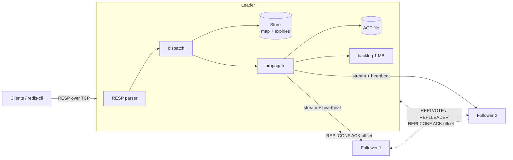

# Redis_Go

A Redis-compatible, replicated key-value database written from scratch in Go — with **persistence, leader–follower replication, automatic failover, and protection against split-brain writes**.

It speaks the real Redis protocol, so the official `redis-cli`, `redis-benchmark` and Redis client libraries work with it unchanged.

```
$ redis-cli -p 6380 SET otp 1234 EX 60
OK
$ redis-cli -p 6381 GET otp          # read from a follower
"1234"
$ docker compose stop node1          # kill the leader...
$ redis-cli -p 6381 INFO replication # ...a follower takes over within seconds
role:master
failover_epoch:1
```

## Highlights

| | |
|---|---|
| **Protocol** | Hand-written RESP parser; binary-safe; handles partial reads and pipelining |
| **Commands** | `GET` `SET` (`EX` `PX` `EXAT` `PXAT` `NX` `XX`) `DEL` `EXISTS` `EXPIRE` `PEXPIRE` `EXPIREAT` `PEXPIREAT` `TTL` `PTTL` `PERSIST` `PING` `ECHO` `INFO` `WAIT` |
| **Expiry** | Lazy expiration + Redis's active sampling algorithm (20 keys / 100 ms, repeat if >25% expired) |
| **Persistence** | Append-only file, `always` / `everysec` / `no` fsync, crash recovery of a half-written tail |
| **Replication** | Snapshot + live stream, partial resync from a 1 MB backlog, heartbeats, read-only followers |
| **Failover** | Raft-inspired elections: epochs, one vote per epoch, majority required, most-up-to-date candidate wins |
| **Safety** | Leader refuses writes without a majority (`NOREPLICAS`); `WAIT` for synchronous replication |
| **Verified** | 40 tests under the race detector, incl. kill-the-leader failover and **100,000 random commands compared against real Redis** |

## Quick start

```bash
# single server
go run .
redis-cli -p 6380 SET name sushant

# 3-node cluster with automatic failover
docker compose up --build
```

Without Docker, start three terminals:

```bash
go run . -port 6380 -peers localhost:6381,localhost:6382
go run . -port 6381 -replicaof localhost:6380 -peers localhost:6380,localhost:6382
go run . -port 6382 -replicaof localhost:6380 -peers localhost:6380,localhost:6381
```

Every node of a cluster must be started with `-peers`; a node started without it runs standalone.

| Flag | Default | Meaning |
|---|---|---|
| `-port` | `6380` | port to listen on |
| `-aof` | `auto` → `appendonly-<port>.aof` | append-only file (`""` = no persistence) |
| `-appendfsync` | `everysec` | `always`, `everysec` or `no` |
| `-replicaof` | | start as a follower of `host:port` |
| `-peers` | | the other nodes; enables automatic failover |
| `-announce` | `localhost:<port>` | the address other nodes use for this one |

## Architecture



Every write goes through **one function, `propagate`**, which encodes it once and sends the same bytes to the AOF and to every follower. Writes run one at a time under a single lock, so the AOF, the followers and memory always see the same order. Reads run in parallel.

| File | Responsibility |
|---|---|
| `resp.go` | RESP parsing and encoding |
| `store.go` | the data, expiry (lazy + active), snapshots |
| `commands.go` | command table, read-only and majority checks |
| `aof.go` | append-only file, fsync policies, replay and crash recovery |
| `server.go` | connections, reply buffering, shared server state |
| `replication.go` | handshake, full/partial resync, live stream, ACKs |
| `backlog.go` | ring of recent stream bytes for partial resync |
| `failover.go` | elections, votes, promotion, stepping down |
| `wait.go` | `WAIT` (synchronous replication on demand) |

## Design decisions and trade-offs

**Writes are serialized, reads are parallel.** A single write lock covers "apply + log + replicate", so the AOF and followers always receive writes in the order they were applied. Real Redis runs everything on one thread; this design keeps that ordering guarantee while letting reads use every core.

**Expiry times are stored as absolute timestamps.** `SET k v EX 100` is written to the AOF and the stream as `SET k v PXAT <unix-ms>`. Replaying it after downtime gives the key its *remaining* time, not a fresh 100 seconds, and keys that expired while the server was down stay gone.

**Partial resync.** Leader and followers count the same stream bytes (offsets). A follower that reconnects says "history X, offset N"; if bytes N.. are still in the 1 MB backlog it gets only those (`+CONTINUE`), otherwise a full snapshot. After a failover the new leader remembers the old history id, so the other followers switch over with a partial resync too.

**Elections that can't produce two leaders.** A follower whose leader is silent for 3 s asks its peers for votes. A peer votes yes only if it can't reach a leader either, hasn't voted for anyone else in this epoch, and the candidate has at least as much data as it does. Winning needs a majority of the *whole* cluster; any two majorities share a node, and that node only votes once per epoch. Random election delays prevent repeated split votes. Leaders that come back, or were cut off, see a higher epoch and step down.

**No writes without a majority.** Followers ACK every second. A leader that hasn't heard from a majority within 2 s rejects writes with `NOREPLICAS`. Because 2 s < the 3 s before followers may start an election, an isolated old leader stops accepting writes *before* a new leader can exist, so the two sides of a network split never diverge.

**Durability is a per-write choice.** Replication is asynchronous by default (fast). For writes that must survive a failover, a client sends `WAIT <n> <timeout>`; the leader asks followers for an immediate ACK (`REPLCONF GETACK`) and replies once `n` have the data. A write confirmed on a majority survives any failover, by the same overlapping-majority argument as the elections.

## Testing

```bash
go test -race ./...                              # 40 tests, race detector on
REDIS_ADDR=localhost:6379 go test -run Differential -v   # vs. real Redis
```

- **Unit tests** for the parser (partial reads, binary-safe values), expiry (with a fake clock — no sleeping), every command and error message.
- **Persistence tests**: restart survival, remaining TTL after downtime, truncated-tail recovery, corruption detection.
- **Replication and failover tests** run real servers on random ports: snapshot and live sync, partial resync, kill the leader → exactly one new leader, old leader rejoins as a follower, minority leader refuses writes, `WAIT`.
- **Differential test**: 100,000 random commands (valid and invalid) sent to this server and to a real Redis 7 — every reply must be byte-for-byte identical (TTLs within 1 s). Runs in CI against a Redis service container.

> On WSL, `-race` needs a C compiler: `sudo apt install build-essential`.

## Benchmarks

`./bench.sh` runs `redis-benchmark` (50 clients) against this server and against Redis 7.0.15, both with `appendfsync everysec`.
Measured on a 2-vCPU Linux VM; numbers will differ on your machine.

| Requests / second | SET | GET |
|---|---:|---:|
| **Redis_Go**, one command at a time | 70,300 | 70,700 |
| Redis 7, one command at a time | 82,300 | 88,100 |
| **Redis_Go**, pipelined (16 per batch) | 269,800 | 662,700 |
| Redis 7, pipelined (16 per batch) | 693,500 | 1,116,100 |

Without pipelining this server reaches ~80–85% of Redis; both are limited mostly by network round trips.

**Finding and fixing a bottleneck:** the first version wrote each reply to the socket immediately, which made pipelined throughput only 128k SET / 227k GET. Replies are now buffered and flushed once there are no more commands waiting to be read, which batches a whole pipeline into one write: **2.1× faster SET, 2.9× faster GET**.

The remaining gap with pipelining comes mostly from the global write lock, per-command allocations in the parser, and Go's goroutine-per-connection model versus Redis's single-threaded event loop.

## Limitations

Honest notes on what this is not:

- Strings only — no lists, hashes, sets or sorted sets; no transactions, pub/sub or Lua.
- The AOF is never compacted (no `BGREWRITEAOF`), so it grows with every write.
- The election epoch and vote are kept in memory, not on disk as Raft requires.
- Failover safety depends on timeouts; a leader frozen for several seconds could briefly overlap with its successor.
- Asynchronous by default: without `WAIT`, a write acknowledged a moment before the leader crashes can be lost (same as Redis).
- No authentication or TLS; nodes trust each other's replication commands.
